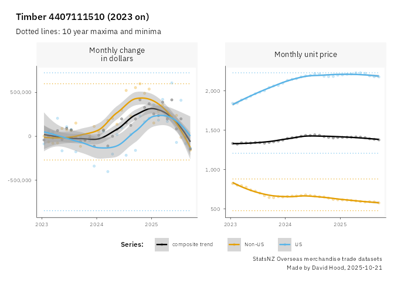

# NZ Trade notes
David Hood

``` r
library(readr) # read in data
library(dplyr) # process data
library(scales) # some graph axis formatting
library(ggplot2) # graphmaking
library(lubridate) # making consistent dates
library(slider) # rolling period calculations
source("theme.R") # my prefered theming (loads ggthemes)
```

This is my (David Hood’s) guidance for anyone using R to have a look at
NZ’s mercantile trade export data with the intent of explore US tariff
effects in the data. The read it on github version is the README.md, the
use with R code in RStudio version is the README.qmd.

The graph code (in particular the theming) is using some ggplot 4
features, but the R processing code is pretty recent R generic.
Libraries and support files used include:

The starting point is: - From the StatsNZ webpage
https://www.stats.govt.nz/large-datasets/csv-files-for-download/overseas-merchandise-trade-datasets/

- Download all the **Exports HS10 by Country** csv files from the areas
  2025 datasets for exports (provisional), 2025 datasets for exports
  (final), and the similar export files from Yearly datasets of imports
  and exports from 2015 onward, and put them in a data folder. These
  notes were written with the September data release and I checked there
  was nothing odd with the October release, before putting this out into
  the world on the day of the October release.

The HS10 are the detailed commodity breakdowns, and the by Country lets
us split out the US trade in comparison to the rest of the world. For
the purposes of this I am ignoring reexports as both negligble and
confusing to think about trade, and focusing on the export numbers.
There are a few quirks with things like changed column titles / missing
leading zeros in codes in some of the files / etc that need fixing

``` r
datafiles <- list.files(path = "data", pattern="csv$", full.names = TRUE)
# there are blank columns at the end of some of the sheets
# so once the code was working fine i just turned off
# warnings, as I already know that

listoffiles <- lapply(datafiles, read_csv, col_types=cols(.default=col_character()))
# Reads multiple CSV files from the data folder.
# due to inconsistent column type detection (and names),
# reading everything in as text columns 
# then formally setting later
dfiles <- bind_rows(listoffiles)
# inconsistent column names over time
# means some cleanup like of two specific columns,
# take the non-null entry (standardises the names at the same time)
# also converting date and numeric fields to usable formats.
cleaned <- dfiles |> 
  mutate(YearMonth = ifelse(is.na(month),Month, month),
         HScode = as.numeric(ifelse(is.na(hs), `Harmonised System Code`, hs)),
         HSdesc = ifelse(is.na(hs_desc), `Harmonised System Description`, hs_desc),
         countryName = ifelse(is.na(country), Country, country),
         FOBexport = ifelse(is.na(Export_FOB), `Exports ($NZD fob)`, Export_FOB),
         QTYexport = ifelse(is.na(Export_Qty), `Exports Qty`, Export_Qty),
         FOBreexport = ifelse(is.na(Re_export_FOB), `Re-exports ($NZD fob)`, Re_export_FOB),
         QTYreexport = ifelse(is.na(Re_export_Qty), `Re-exports Qty`, Re_export_Qty),
         FOBtotal = ifelse(is.na(total_export_FOB), `Total Exports ($NZD fob)`, total_export_FOB),
         QTYtotal = ifelse(is.na(total_export_qty), `Total Exports Qty`, total_export_qty)
         ) |> 
  select(YearMonth:QTYtotal) |> 
  mutate(datey = substr(YearMonth,1,4),
         datemnt= substr(YearMonth,5,6),
    dateymd = ymd(paste0(datey,"-",datemnt,"-","15")),
         priceNZD= as.numeric(gsub(",","",FOBexport)),
         qty= as.numeric(gsub(",","",QTYexport)))
```

In exploring this data, I have been advised for smaller botique
exporting the quantity field can be a bit approximate and value is a
much more reliable indicator. I will also note that provisional data,
particularly in the first month of relase, can change by a few percent,
due to things like late or cancelled shipments etc. For this reason I
think it a very poor plan to read too much significance into small
changes in the most recent month of data.

Also F.O.B. prices do not include tariff costs, so we are looking at
secondary effects in trade (things like the US buying less).

## Total Trade Balance US vs all others

We can forget about detailed commdities for a moment and look at the big
picture, aggregating the monthly data by US or not.

``` r
totalled <- cleaned |> 
  filter(!is.na(priceNZD)) |> 
  mutate(isUS = ifelse(countryName == "United States of America",
                       "US", "all non-US")) |>
  summarise(.by=c(isUS, dateymd),
            total_value = sum(priceNZD))

ggplot(totalled, aes(x=dateymd, y=total_value, colour=isUS)) +
  geom_point() + facet_wrap(~isUS, ncol=1, scales="free_y") + theme_david() +
  theme(legend.position = "bottom",
        axis.title.y.left = element_blank(),
        axis.title.x.bottom  = element_blank(),
        legend.key.spacing.x  = unit(18, "pt")) +
  labs(title="Monthy total trade value",
       x="", y="", caption=make_footer("StatsNZ Overseas merchandise trade datasets"))+
  scale_y_continuous(labels = label_number(accuracy = 1, big.mark = ","))+
  scale_colour_manual(name="Region:     ", values=six_cols) 
```


Because of the month to month variation, it is tricky to say much about
recent trends for either the US or all others. As an alternative there
is the ratio between the US and all others which is much easier to see
comparative differences.

``` r
totalled |> 
  arrange(dateymd, isUS) |> 
  summarise(.by=dateymd,
            percent=100 * total_value[1]/total_value[2]) |> 
  ggplot(aes(x=dateymd, y=percent)) + geom_point() +
  theme_david() +
  theme(legend.position = "bottom",
        axis.title.y.left = element_blank(),
        axis.title.x.bottom  = element_blank(),
        legend.key.spacing.x  = unit(18, "pt")) +
  labs(title="Monthy US trade value as percentage of non-US",
       x="", y="", caption=make_footer("StatsNZ Overseas merchandise trade datasets"))+
  scale_y_continuous(labels = label_number(accuracy = 1, big.mark = ","))
```


At a very broad level, we can say that trade to the US has not been
going up like it has been from 2020 to 2023, but has not fallen to
levels it was at in 2019. It might be clearer for a quick summary to
take a rolling twelve month period (the month in question plus previous
11 months), to smooth out monthly/seasonal variation.

``` r
  totalled |> 
  arrange(dateymd, isUS) |> 
  summarise(.by=dateymd,
            percent=100 * total_value[1]/total_value[2]) |> 
  mutate(rolled = slide_dbl(percent, mean, .before = 11, .complete = TRUE)) |> 
  ggplot(aes(x=dateymd, y=percent)) + 
  geom_point(colour="#EEEEEE") +
  geom_point(aes(y=rolled)) +
  theme_david() +
  theme(legend.position = "bottom",
        axis.title.y.left = element_blank(),
        axis.title.x.bottom  = element_blank(),
        legend.key.spacing.x  = unit(18, "pt")) +
  labs(title="Rolling 12 month mean US trade value as percentage of non-US",
       x="", y="", caption=make_footer("StatsNZ Overseas merchandise trade datasets"))+
  scale_y_continuous(labels = label_number(accuracy = 1, big.mark = ","))
```


As well as reinforcing the “down (the US less of a trade partner) but
not by as much as in the past (yet)”, it is clear the overall US market
platued as of June 2023, and fallen during this year. While it has done
so in earlier periods during the last rise, those were for shorter time
frames (8 months rather than the latest 14).

But, as a data design, presenting the data in this way this graph
carries the implicit assumption that the reader is interested in the
trade balance of the US compared to elsewhere- the importance of the
market in terms of total export value for New Zealand. Making the above
graph also means suppressing some of the warnings about missing values,
where the months at the start of the time series did not have.

It is also worth checking total value, to see if there is any indication
of world markets being satiated with New Zealand products (rather than
market switch from US to other markets)

``` r
  rolled_total <- totalled |> 
  arrange(dateymd) |> 
  summarise(.by=dateymd,
            permonth=sum(total_value)) |> 
  mutate(rolled = slide_dbl(permonth, mean, .before = 11, .complete = TRUE)) 
  ggplot(rolled_total, aes(x=dateymd, y=permonth)) + 
  geom_point(colour="#EEEEEE") +
  geom_point(aes(y=rolled)) +
  theme_david() +
  theme(legend.position = "bottom",
        axis.title.y.left = element_blank(),
        axis.title.x.bottom  = element_blank(),
        legend.key.spacing.x  = unit(18, "pt")) +
  labs(title="12 month rolling total export trade value (all countries)",
       x="", y="", caption=make_footer("StatsNZ Overseas merchandise trade datasets"))+
  scale_y_continuous(labels = label_number(accuracy = 1, big.mark = ","))
```


Line go up, in this case, is more compatible with optimism than line go
down. And generally the line is going up. So, there is no particular
evidence that there is a lack of demand in total for NZ exports, though
the “in an alternative world the amount would have been” is a bit
speculative - we don’t know how much the line might be different with
different conditions and we don’t know about “compared to what” (what
value actually is over time).

Something that might useful is indexing export value against cost of
living increases, to get a sense of the NZ export purchasing power in
NZ. I’m doing this because it seems like an easy idea to implement and a
good idea at the time. Downloading the quarterly Group: Consumers Price
Index - CPI, Table: CPI All Groups for New Zealand
(Qrtly-Mar/Jun/Sep/Dec) from https://infoshare.stats.govt.nz (in this
case, saved as CPI.csv)

``` r
CPI <- read_csv("CPI.csv", skip=1)
CPIclean <- CPI |> 
  mutate(CPI = as.numeric(`All groups`),
         datey = substr(`...1`,1,4),
         datemnt= as.numeric(substr(`...1`,6,6))*3,
    dateymd = ymd(paste0(datey,"-",datemnt,"-","15"))) |> 
  right_join(rolled_total,by = join_by(dateymd)) |> 
  arrange(dateymd) |> 
# the first combined entry is the 12th row
  mutate(inflated = rolled[12] *CPI/CPI[12])

ggplot(CPIclean, aes(x=dateymd, y=permonth)) + 
  geom_point(colour="#EEEEEE") +
  geom_point(aes(y=rolled)) +
  geom_point(aes(y=inflated), colour=six_cols[2]) +
  theme_david() +
  theme(legend.position = "bottom",
        axis.title.y.left = element_blank(),
        axis.title.x.bottom  = element_blank(),
        legend.key.spacing.x  = unit(18, "pt")) +
  labs(title="12 month rolling total export trade value (all countries)
now with CPI change indexed to the same starting point",
       x="", y="", caption=make_footer("StatsNZ Overseas merchandise trade datasets, StatsNZ Infoshare"))+
  scale_y_continuous(labels = label_number(accuracy = 1, big.mark = ","))
```


While there is a lot of “it’s complicated” about what value means and if
CPI is the ideally best comparison everywhere for all available data,
the black line being above the orange line since 2018 is broadly
suggestive of a better state of affairs for NZ (getting more for stuff
made than needing to spend on stuff) that 2016-2017. Which kind of makes
sense since people all over the world have be complaining about
commodity prices. At this level, I can’t think of much more to check
around this, but that does double as a worked example of bringing some
other data in.

All of that was done with total value. If we want to focus in a bit for
US tariff relevance, we can select significant US commodities. With the
ambigious idea of “significant”, nne interpretation of significance are
commodities the US buys a lot of. So that needs an all-time value
shortlist by commodity.

``` r
bigspendsUS <- cleaned |> 
  filter(countryName == "United States of America") |> 
  summarise(.by=c(HScode, HSdesc),
            alltimeFOB = sum(priceNZD)) |> 
  arrange(desc(alltimeFOB)) |> 
  slice(1:10)

knitr::kable(bigspendsUS |> select(-alltimeFOB))
```

| HScode | HSdesc |
|---:|:---|
| 202300001 | Meat; of bovine animals, beef cuts according to the NZ Meat Producers’ Board definition, of cow, steer and heifer, boneless, frozen |
| 202300011 | Meat; of bovine animals, boneless cuts of bull, frozen |
| 2204211801 | Wine; still, (not containing more than 14% vol.), white, in containers of a capacity not exceeding 750ml, not for further manufacture in a licensed manufacturing area |
| 404901900 | Dairy produce; natural milk constituents (excluding whey), concentrated or sweetened, other than liquid or semi-solid, n.e.c. in chapter 4 |
| 204420001 | Meat; of sheep, lamb cuts with bone in, frozen (excluding carcasses and half-carcasses) |
| 3501100001 | Casein; acid |
| 9019200000 | Therapeutic respiration apparatus; ozone, oxygen, aerosol therapy apparatus; artificial respiration or other therapeutic respiration apparatus |
| 204220001 | Meat; of sheep, lamb cuts with bone in, fresh or chilled (excluding carcasses and half-carcasses) |
| 810500010 | Fruit, edible; kiwifruit, gold fleshed, fresh |
| 4407111510 | Wood; coniferous species, of pine (Pinus radiata), sawn or chipped lengthwise, sliced or peeled, of a thickness exceeding 6mm, planed, square dressed, structural, not preservative treated |

Of the top ten, I think a selection (and some combinations of similar to
me entries) would be an interesting range of comparisons:

- Bovine meat 202300001 + 202300011 together
- Wine 2204211801
- Dairy 404901900
- Therapeutic respiration apparatus 9019200000
- Golden Kiwifruit 810500010
- Structural Pine timber 4407111510

Given the seasonality of some of the entries, a rolling twelve month
period seems useful. So I am writing a function that takes the dataset
and a group of ID numbers, and produces a base graph ready for final
annotations. Because I am going to automatically chosen smoothed lines
of best fit, I am by default restricting the data range displayed to
since 2023, as that (through a bit of thinking and test tinkering) seems
to give a range sensitive to recent changes without being too sensitive
to random effects. However, I am still using the decades worth of
figures to calculate some overall decadal summary values.

``` r
twopanelsetup <- function(x, mydata=cleaned, datelimit = ymd("2023-01-01")){
  
  paneldata1a <- mydata |> filter(HScode %in% x) |> 
  mutate(isUS = ifelse(countryName == "United States of America", "US", "Non-US")) |> 
  summarise(.by=c(dateymd, isUS),
            value = sum(priceNZD, na.rm=TRUE)) |> 
  arrange(isUS, dateymd) |> 
  group_by(isUS) |> 
  mutate(rolling12value = slide_dbl(value, mean, .before = 11, .complete = TRUE),
         offset= rolling12value - lag(rolling12value),
         decademax = max(offset, na.rm=TRUE),
         decademin = min(offset, na.rm=TRUE)) |>
  ungroup() |> 
  filter(!is.na(offset), dateymd > datelimit) |> 
  select(isUS, dateymd, Value = offset, decademax, decademin) |> 
  mutate(Measure = "Monthly change\nin dollars") 
  
  paneldata1b <- paneldata1a |> 
    summarise(.by=c(dateymd,Measure),
              Value = mean(Value)) |> 
    mutate(isUS = "composite trend")
  
  panel1 <- bind_rows(paneldata1a,paneldata1b)
  
  paneldata2a <- mydata |> filter(HScode %in% x) |> 
  mutate(isUS = ifelse(countryName == "United States of America", "US", "Non-US")) |> 
  summarise(.by=c(dateymd, isUS),
            value = sum(priceNZD, na.rm=TRUE),
            volume = sum(qty, na.rm=TRUE)) |> 
  arrange(isUS, dateymd) |> 
  group_by(isUS) |> 
  mutate(rolling12value = slide_dbl(value, mean, .before = 11, .complete = TRUE),
         rolling12qty = slide_dbl(volume, mean, .before = 11, .complete = TRUE),
         unitvalue = rolling12value/rolling12qty,
         decademax = max(unitvalue, na.rm=TRUE),
         decademin = min(unitvalue, na.rm=TRUE)) |>
  ungroup() |> 
  filter(!is.na(unitvalue), dateymd > datelimit) |> 
  select(isUS, dateymd, Value = unitvalue, decademax, decademin) |> 
  mutate(Measure = "Monthly unit price")
  
  paneldata2b <- paneldata2a |> 
    summarise(.by=c(dateymd,Measure),
              Value = mean(Value)) |> 
    mutate(isUS = "composite trend")
  
  panel2 <- bind_rows(paneldata2a,paneldata2b)

  grafdata <- bind_rows(panel1,panel2)
  
  
output <- ggplot(grafdata, aes(x=dateymd, y=Value, colour=isUS)) +
  geom_line(aes(y=decademax), linetype=3)+ 
  geom_line(aes(y=decademin), linetype=3)+
  geom_point(alpha=.3) + geom_smooth(method = 'loess', formula = 'y ~ x') +
  facet_wrap(~Measure, ncol=3, scales="free_y") +
  guides(color = guide_legend(direction = "horizontal")) +
  theme_david() +
  theme(legend.position = "bottom",
        axis.title.y.left = element_blank(),
        axis.title.x.bottom  = element_blank(),
        legend.key.spacing.x  = unit(18, "pt")) +
  scale_colour_manual(name="Series:     ", values=six_cols) +
  scale_y_continuous(labels = label_number(accuracy = 1, big.mark = ","))
output
  return(output)
}
```

``` r
graphbase <- twopanelsetup(x=c(202300001,202300011))
graphbase +
  labs(title="Frozen bovine meat exports 202300001,202300011 (2023 on)",
       subtitle="Dotted lines: 10 year maxima and minima",
       x="", y="", caption=make_footer("StatsNZ Overseas merchandise trade datasets"))
```


This is what I would call an information dense graph. The first (left)
panel is the monthly change in dollars of the 12 month rolling mean from
the previous month. So if the blue (US) line is falling and the orange
(all non-US) line is rising by the same amount, then that is a move
between markets. In similar ways this could also be showing both markets
growing (line go up) but by different amounts, and similarly both
markets falling (line go down)

The right panel divides the 12 month rolling value by the 12 month
rolling quantity to get a unit price over time figure. This could
capture a number of different things- changes in the exported amount of
a range of different price point products with a category, trying to
preserve a US market for particular reasons (effectively subsidising
with other exports). I am using the right panel to give some hints to
how to think about changes in the left panel.

And because the lines of best fit are only for the shown (2023+) data, I
am also including dotted lines showing the maximum and minimum for US/
non-US over the last decade. To help judge how far out of historical
ranges things are.

The black line is a composite line of the average of the two lines for
each month, just to make it a bit easier to see where the balance
between the two lines is changing.

In the specific case of 202300001 & 202300011 (both frozen bits of
bovine), it looks a lot like while unit commodity prices are at an all
time high (and there is no difference between Us and non-US) the total
value of exports to the US is falling faster than the rise in total
value to everywhere else. And because unit prices are high, that means
there is a hit in volumes. Not enough to dramatically impact yet, but
the kind of direction that leaves the sector potentially vulnerable over
the next 12 months.

``` r
graphbase <- twopanelsetup(x=c(2204211801))
graphbase +
  labs(title="Wine 2204211801 (2023 on)",
       subtitle="Dotted lines: 10 year maxima and minima",
       x="", y="", caption=make_footer("StatsNZ Overseas merchandise trade datasets"))
```


For wine, there are no particular market specific changes showing in the
data, with the two groups following the same path- a major drop in 2023
with stabilisation/recovery since then.

``` r
graphbase <- twopanelsetup(x=c(404901900))
graphbase +
  labs(title="Dairy 404901900 (2023 on)",
       subtitle="Dotted lines: 10 year maxima and minima",
       x="", y="", caption=make_footer("StatsNZ Overseas merchandise trade datasets"))
```


Dairy has seen no growth in the US for a while, with the growth coming
from elsewhere. The price per unit is also showing as lower for the US
these days (again that could be specific products as well as prices for
similar products). A bit like beef, I look at that and think that there
is room for a downturn in the next 12 months.

``` r
graphbase <- twopanelsetup(x=c(9019200000))
graphbase +
  labs(title="Therapeutic breathing devices 9019200000 (2023 on)",
       subtitle="Dotted lines: 10 year maxima and minima",
       x="", y="", caption=make_footer("StatsNZ Overseas merchandise trade datasets"))
```


Therapeutic breathing devices have no volume of exports, just value, so
the second graph fails. Which I assume is describing F&P sleep apnoea
devices sold out of NZ but manufactured elsewhere. Which is an
interesting quirk in the data. A pretty unchanged category in recent
years.

``` r
graphbase <- twopanelsetup(x=c(810500010))
graphbase +
  labs(title="Golden Kiwifruit 810500010 (2023 on)",
       subtitle="Dotted lines: 10 year maxima and minima",
       x="", y="", caption=make_footer("StatsNZ Overseas merchandise trade datasets"))
```


A flat (possibly until very recently) US total value combined with
steeply rising unit prices does suggest a fall off in volumes combined
with substitute markets.

``` r
graphbase <- twopanelsetup(x=c(4407111510))
graphbase +
  labs(title="Timber 4407111510 (2023 on)",
       subtitle="Dotted lines: 10 year maxima and minima",
       x="", y="", caption=make_footer("StatsNZ Overseas merchandise trade datasets"))
```



This looks a lot like a general wordlwide downturn in demand for timbre
for construction with the US market having a distinctive product mix
(unit price).

As different way of shortlisting commodities of interest to identify
industries most reliant on the US market. This strategy shortlists those
codes with the highest US Value compared to non US. But as this could
include some very sparse data (a commodity with very few records so
unreliable trends) I am also add a limit of the commodity being a
complete time series.

``` r
relativespendsUS <- cleaned |> 
  mutate(isUS = ifelse(countryName == "United States of America", "US", "all others")) |> 
  summarise(.by=c(HScode, HSdesc, dateymd, isUS),
            value = sum(priceNZD, na.rm=TRUE)) |> 
  group_by(HScode, HSdesc) |> 
  mutate(entries = n()) |> 
  ungroup() |> 
  filter(entries == max(entries)) |> 
  summarise(.by=c(HScode, HSdesc, isUS),
            alltimeFOB = sum(value)) |>
  arrange(HScode, HSdesc, isUS) |> 
  summarise(.by = c(HScode, HSdesc),
            ratio = alltimeFOB[1]/alltimeFOB[2]) |> 
  arrange(desc(ratio)) |> 
  slice(1:10)

knitr::kable(relativespendsUS |> select(-ratio))
```

| HScode | HSdesc |
|---:|:---|
| 8505900001 | Magnets; electro-magnets |
| 304890053 | Fish fillets; frozen, other than in blocks, orange roughy |
| 307710019 | Molluscs; clams, cockles and ark shells (families Arcidae, Arcticidae, Cardiidae, Donacidae, Hiatellidae, Mactridae, Mesodesmatidae, Myidae, Semelidae, Solecurtidae, Solenidae, Tridacnidae and Veneridae), whether in shell or not, live or fresh |
| 302130010 | Fish; fresh or chilled, Pacific salmon (Oncorhynchus nerka/gorbuscha/keta/tschawytscha/kisutch/masou/rhodurus), whole |
| 2208707100 | Liqueurs and cordials; (not for further manufacture), containing more than 14% vol., but not more than 23% vol. |
| 202300011 | Meat; of bovine animals, boneless cuts of bull, frozen |
| 8471410010 | Automatic data processing machines; comprising in the same housing at least a central processing unit and an input and output unit, whether or not combined, n.e.c. in item no. 8471.30 |
| 4016990900 | Rubber; vulcanised (other than hard rubber), milking-machine parts, of non-cellular rubber |
| 511990049 | Animal products; n.e.c. in chapter 5 |
| 404901900 | Dairy produce; natural milk constituents (excluding whey), concentrated or sweetened, other than liquid or semi-solid, n.e.c. in chapter 4 |

While there is overlap (frozen bull meat, dairy produce), there are some
interesting examples:

- Magnets; Electromagnets 8505900001
- Frozen Orange Roughy fillets 304890053
- Molluscs 307710019
- Fresh whole salmon 302130010

``` r
graphbase <- twopanelsetup(x=c(8505900001))
graphbase +
  labs(title="Electromagnets 8505900001 (2023 on)",
       subtitle="Dotted lines: 10 year maxima and minima",
       x="", y="", caption=make_footer("StatsNZ Overseas merchandise trade datasets"))
```


From this data, whoever is selling electromagnets to the US seems to
have a more reliable market than the rest of the world.

``` r
graphbase <- twopanelsetup(x=c(304890053))
graphbase +
  labs(title="Frozen Orange Roughy fillets 304890053 (2023 on)",
       subtitle="Dotted lines: 10 year maxima and minima",
       x="", y="", caption=make_footer("StatsNZ Overseas merchandise trade datasets"))
```


Orange Roughy fillets, with a falling unit price and a reduction in
total US value, is not in a good way as an export market trend. Which I
will say “good” to in a Orange Roughy sustainability of the species
vs. overfishing way.

``` r
graphbase <- twopanelsetup(x=c(307710019))
graphbase +
  labs(title="Molluscs 307710019 (2023 on)",
       subtitle="Dotted lines: 10 year maxima and minima",
       x="", y="", caption=make_footer("StatsNZ Overseas merchandise trade datasets"))
```


With a total market value reduction since the start of 2024 (keeping in
mind these are rolling 12 month figures so read back a year), and a
falling unit price. That looks a lot like a market with more supply than
demand. My first though is that I guess green-lipped mussels are not
such a superfood anymore.

But with this and the Orange Roughy, if I were a business data
journalist, I would probably be looking a bit deeper at the whole
seafood sector.

``` r
graphbase <- twopanelsetup(x=c(302130010))
graphbase +
  labs(title="Fresh whole salmon 302130010 (all dates)",
       subtitle="Dotted lines: 10 year maxima and minima",
       x="", y="", caption=make_footer("StatsNZ Overseas merchandise trade datasets"))
```


Whole Salmon, conversely, has seen a whole lot of gains in the US market
and in unit prices. But I do wonder if there are substitution effects
with the much higher tariffs Canada has been set for not agreeing to be
absorbed by the US. If this is a “they have even higher tariffs” effect,
then that would make these gains highly volatile and out of our control
in the future.

``` r
graphbase <- twopanelsetup(x=c(2208707100))
graphbase +
  labs(title="Liqueurs 2208707100 (all dates)",
       subtitle="Dotted lines: 10 year maxima and minima",
       x="", y="", caption=make_footer("StatsNZ Overseas merchandise trade datasets"))
```


Liquers is a pretty small market, and I think that is starting to show
in the data volatility. This is the kind of level where I would be
reading this in association with a few other commodity codes for
context.

Anyway, that is some code and some thinking for getting people started.
